#### These procedure steps will be followed on the simulator

1. When you click on total solids in water file, a new window will open as shown below, click on description text box to view the definitions. Click on the NEXT button at the bottom right corner to move to the next step.  
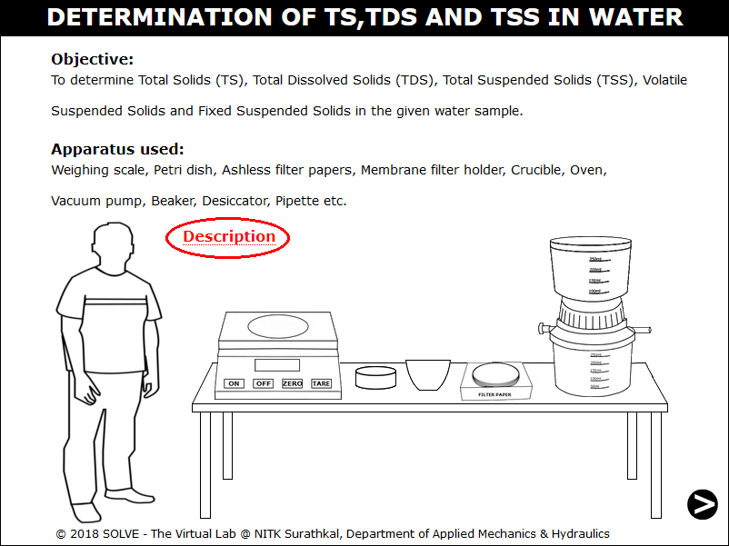 

2. Click on graduated pipette, now click on lower and upper arrows shown to take sample in beaker. 
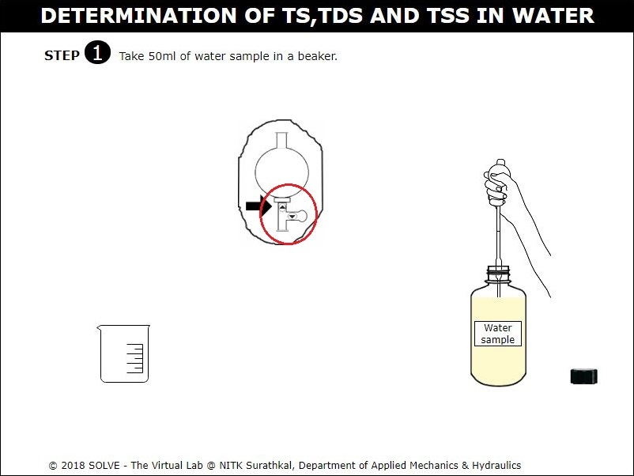 

3. Click on crucible to place it in weighing machine, then petri dish and filter paper to note down the empty weights of each. 
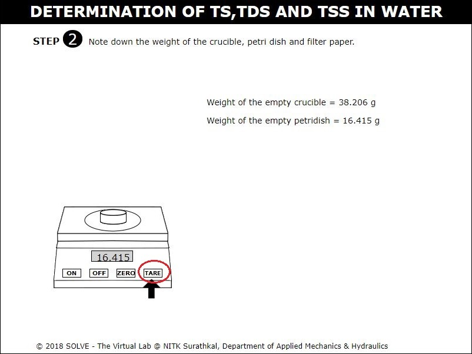 

4. Click on filter paper to place it in the membrane filter and click on beaker to pour 50ml of sample from top of filter slowly. 
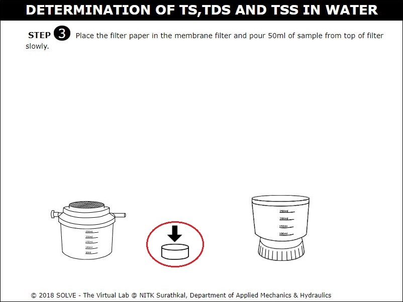 

5. Click on pipe end to connect the filter to vacuum pump. 
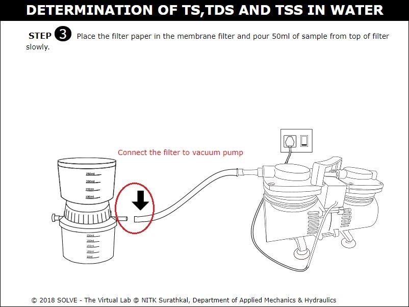 

6. Click on filter paper to take out the filter paper from the filter and click on temperature set button to set oven temperature at 103&deg;C over night. 
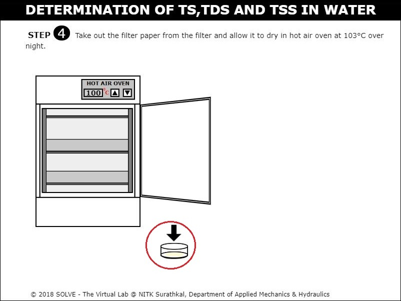 

7. Click on crucible to collect the sample that passes through the filter paper. 
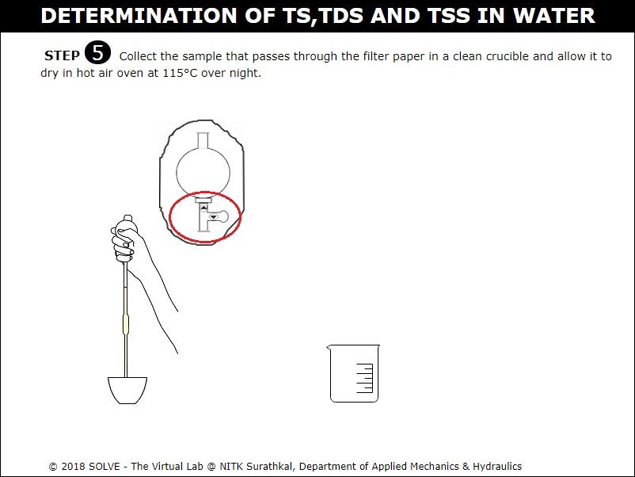 

8. Click to oven door, click on sample to keep it in oven and adjust the temperature set button to to set oven temperature to 115&deg;C over night.  
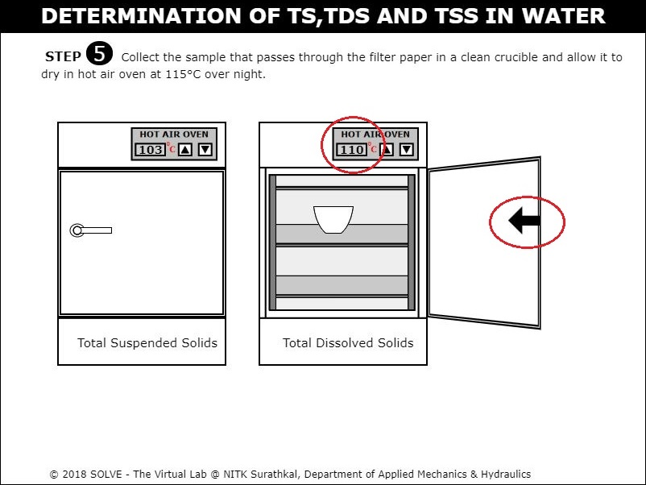 

9. Click on Petri dish and crucible to take out from the hot air oven and allow it cool in desiccator. 
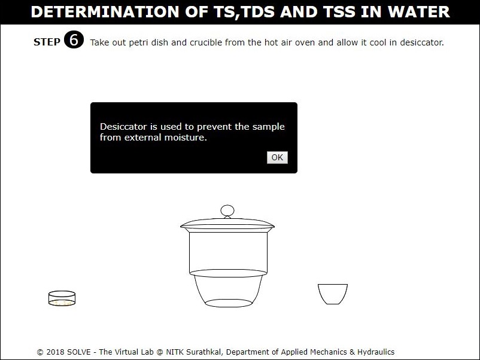 

10. Click on Petri dish and crucible to take it out from the desiccator after it cools down, click on NEXT button.  
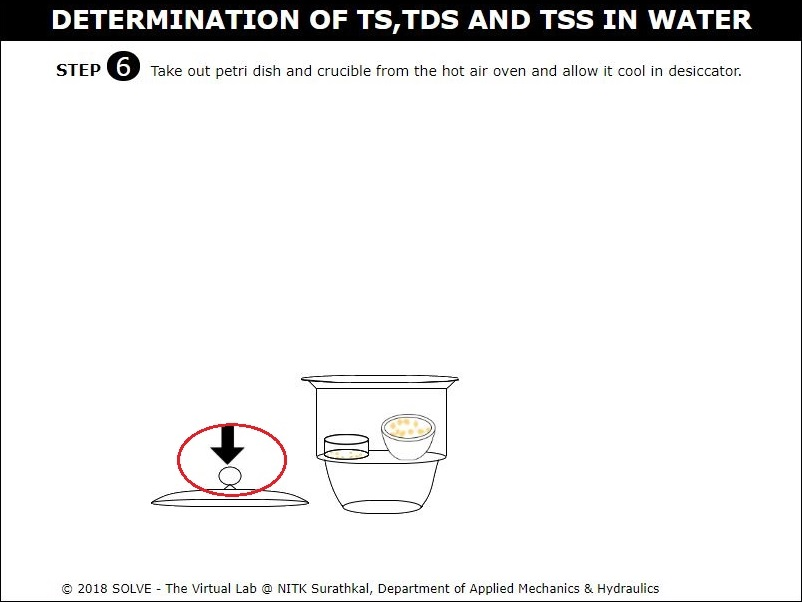 

11. Note down the final weight of the ash less filter paper and final weight of the crucible. 
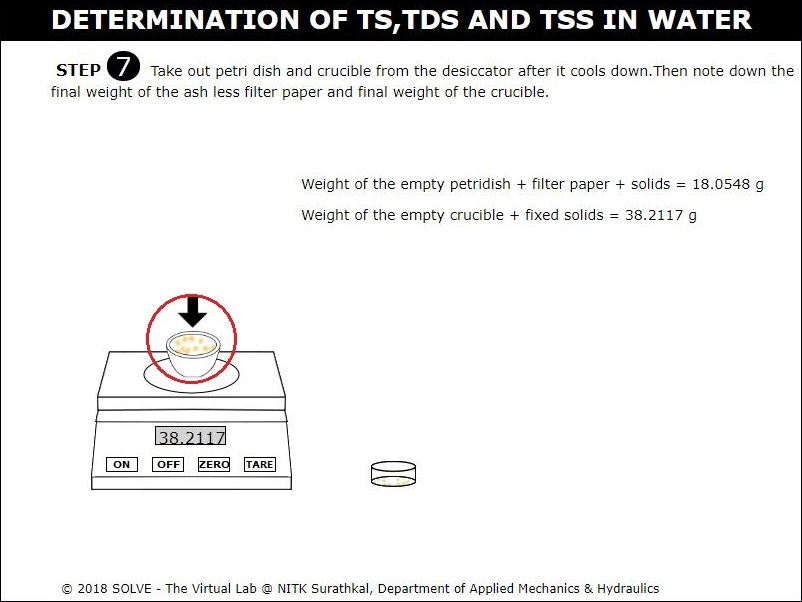 

12. With the help of observation and formulas displayed calculate the values of total suspended solids, total dissolved solids and total solids then enter the value and click on CHECK to check the results, then proceed with the further process. 
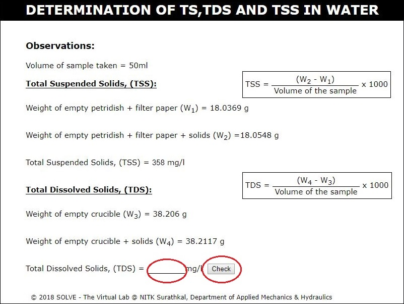 

13. Ignite the filter paper with the solids in a muffle pot at 600&deg;C in a muffle furnace. 
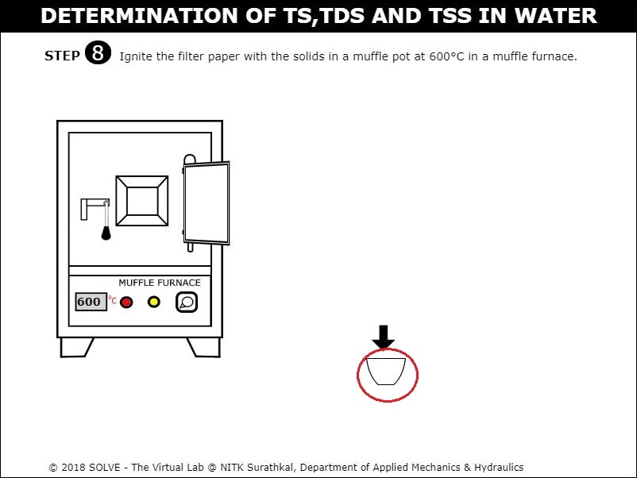 

14. Take out the muffle pot from the desiccator and then note down the weight of it. 
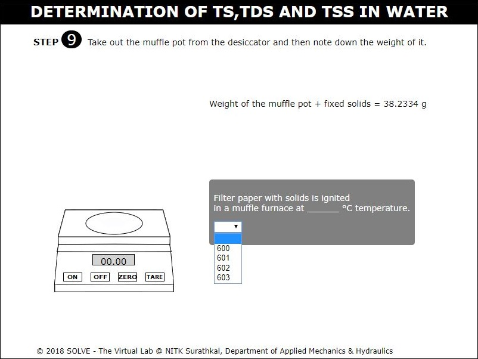 

15. With the help of observation and formulas displayed calculate the values of fixed suspended solids and volatile suspended solids and then check the results. 
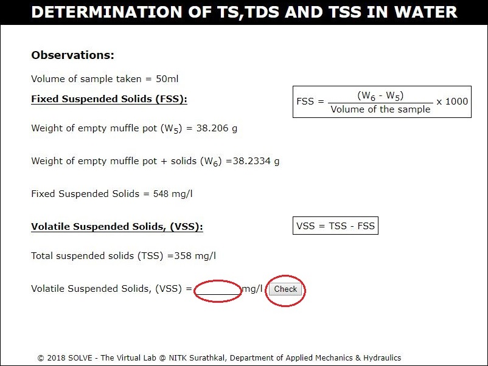 
